# 🏥 Hospital Management System  
### Full Stack Web Application for Healthcare Management

A complete Hospital Management System built using Python and Web Technologies to manage patients, doctors, appointments, and administrative operations efficiently.


## Abstract of the Project

The healthcare industry requires efficient systems to manage patient data, doctor availability, and hospital operations.

This project provides a centralized system where:

- Patients can register and book appointments  
- Doctors can manage schedules and view patient details  
- Admin can monitor overall hospital activities  

The system ensures better data organization, faster access, and improved healthcare service delivery.


## Objectives

- Digitize hospital management processes  
- Manage patient records efficiently  
- Enable doctor-patient interaction  
- Improve hospital workflow and data tracking  


## System Modules

### Admin Module
- Manage doctors  
- View all patients  
- Monitor appointments  
- System overview dashboard  


### Doctor Module
- View assigned patients  
- Update patient records  
- Manage appointments  
- Track treatment details  


### Patient Module
- Register/Login  
- Book appointments  
- View prescriptions  
- Track medical history  


## Application Flow

```text
User Login (Admin / Doctor / Patient)
        ↓
Dashboard Access
        ↓
Perform Operations
        ↓
Database Update
        ↓
Real-Time Data Management
```

## Project Structure

```text
HospitalManagementSystem/
│
├── static/
│   ├── css/
│   ├── js/
│   └── images/
│
├── templates/
│   ├── index.html
│   ├── login.html
│   ├── dashboard.html
│   ├── patient.html
│   ├── doctor.html
│   └── admin.html
│
├── app.py
├── models.py
├── database.db
├── requirements.txt
└── README.md
```

# Application Screenshots

The following screenshots demonstrate the major features of the Hospital Management System.


## Login Window

### Valid Login

<p align="center">
  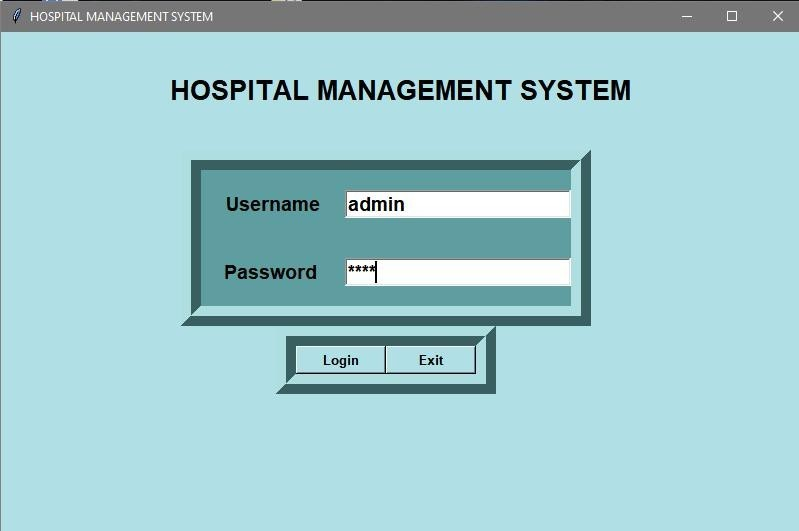
</p>

### Invalid Login

<p align="center">
  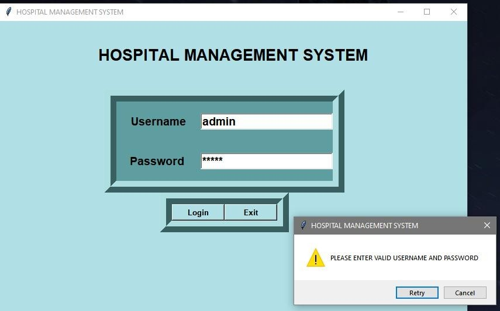
</p>


## Main Menu

<p align="center">
  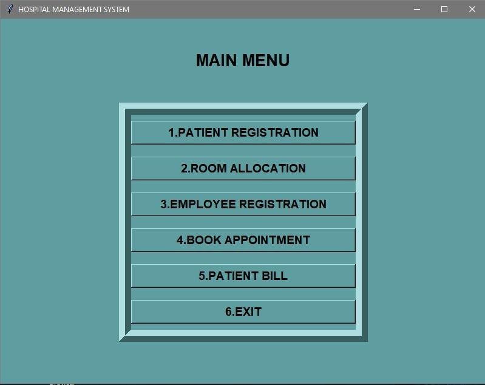
</p>


## Patient Registration

### Submit Patient Details

<p align="center">
  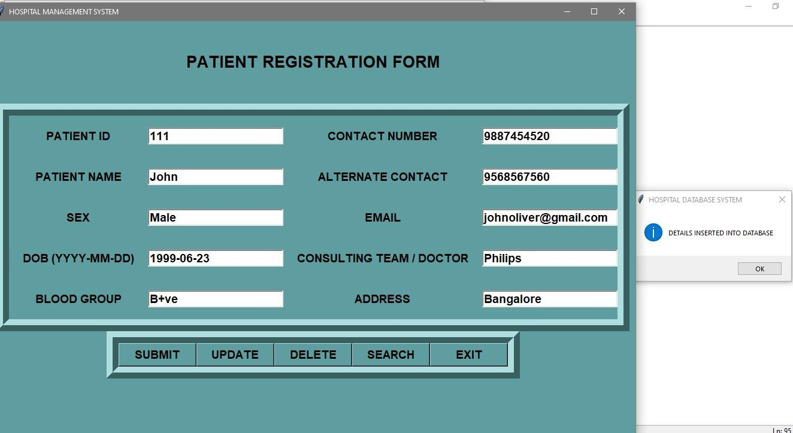
</p>

### Update Patient Details

<p align="center">
  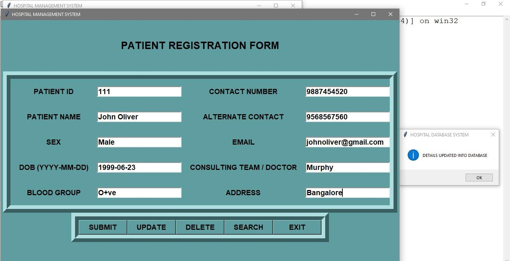
</p>

### Search Patient Record

<p align="center">
  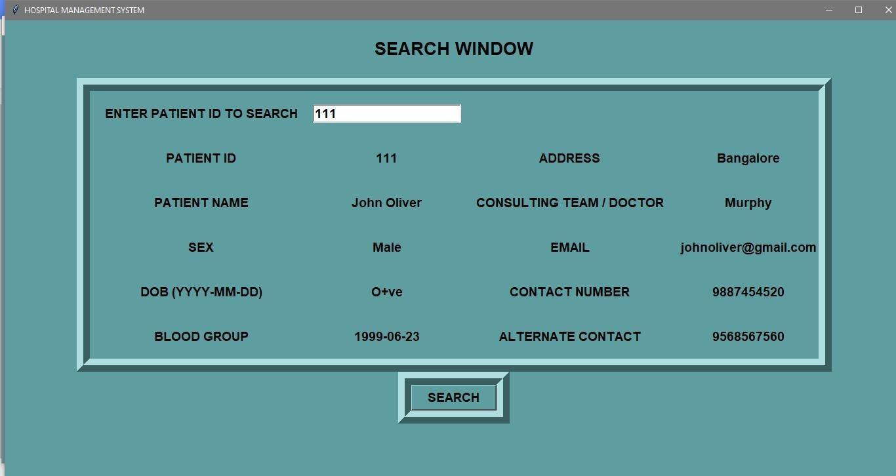
</p>

### Delete Patient Record

<p align="center">
  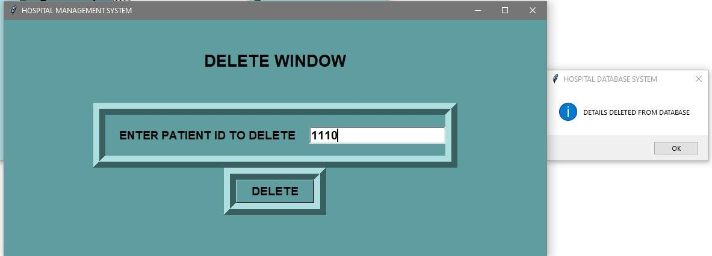
</p>


## Room Allocation

### Allocate Room

<p align="center">
  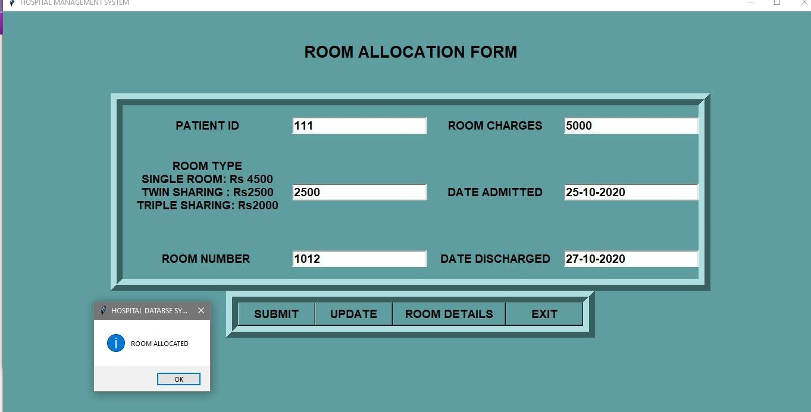
</p>

### Update Room Allocation

<p align="center">
  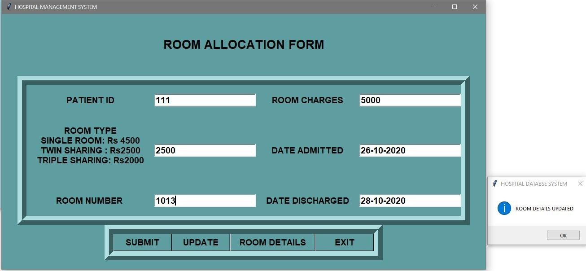
</p>

### View Room Details

<p align="center">
  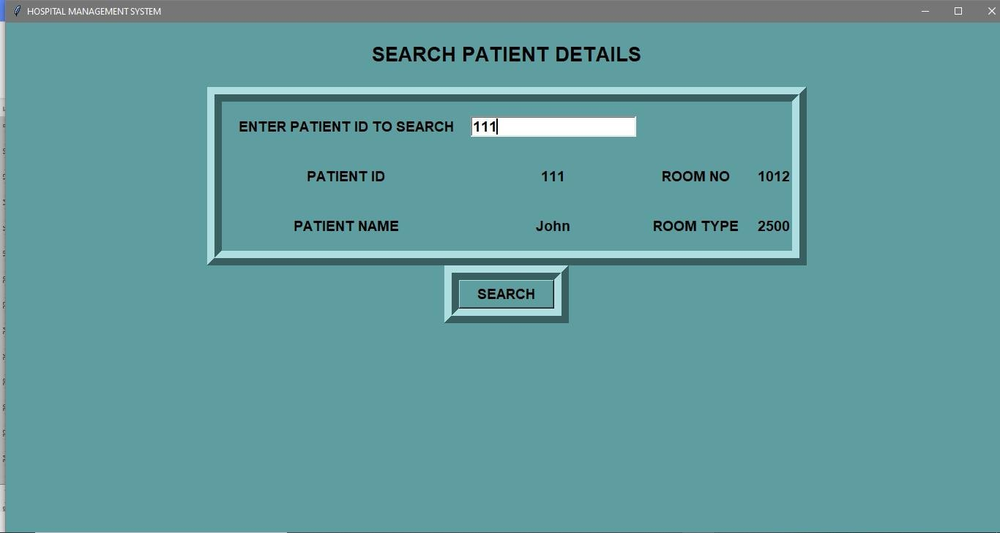
</p>


## Employee Registration

### Save Employee Details

<p align="center">
  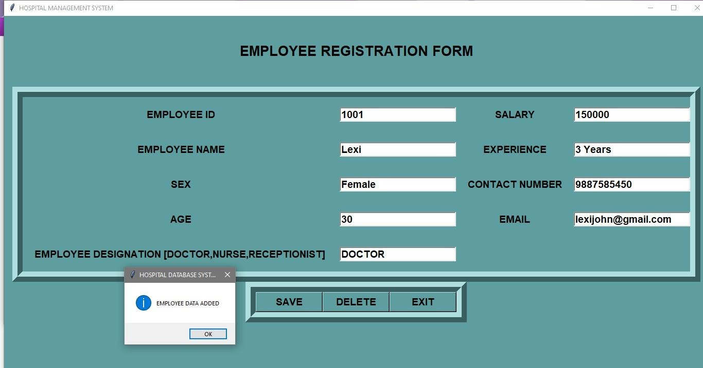
</p>

### Delete Employee Record

<p align="center">
  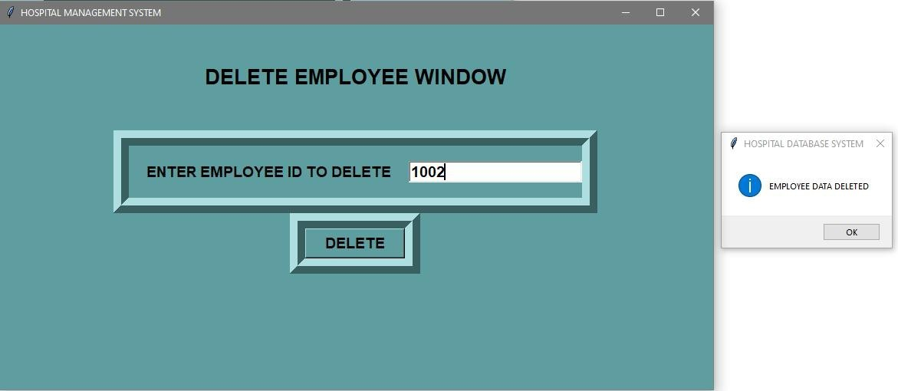
</p>


## Book Appointment

### Save Appointment

<p align="center">
  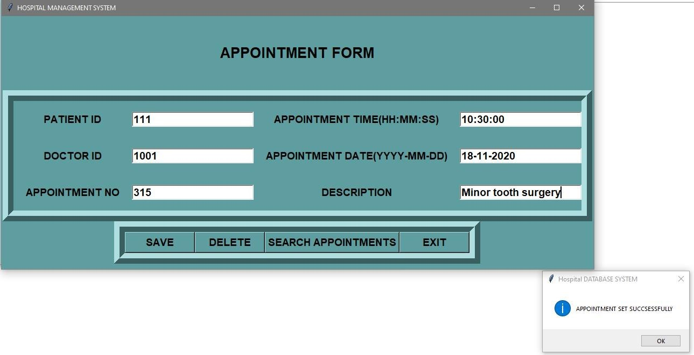
</p>

### Delete Appointment

<p align="center">
  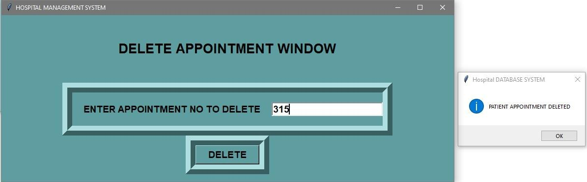
</p>

### Search Appointments

<p align="center">
  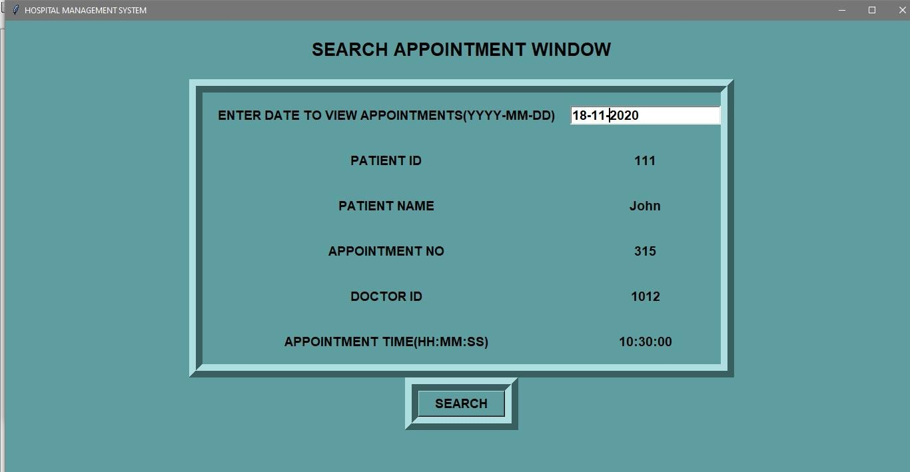
</p>


## Patient Billing

### Update Patient Data

<p align="center">
  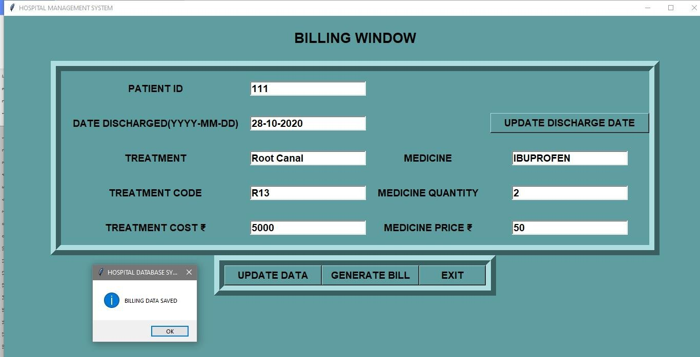
</p>

### Update Discharge Date

<p align="center">
  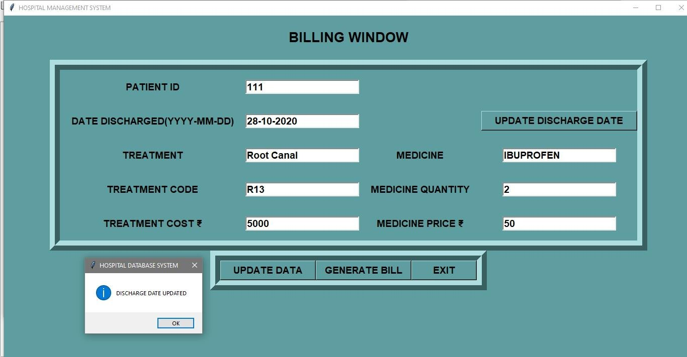
</p>

### Generate Final Bill

<p align="center">
  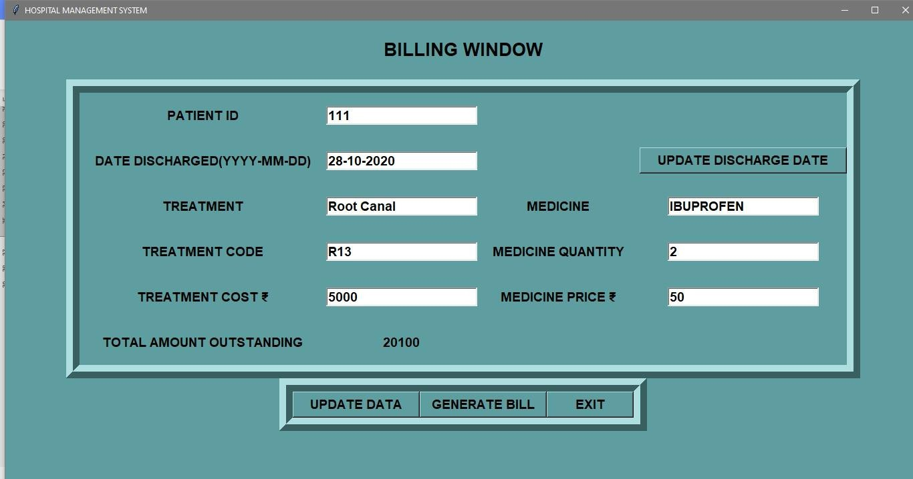
</p>

## Technologies Used

### Backend
- Python  
- Flask / Django  

### Database
- SQLite / MySQL  

### Frontend
- HTML  
- CSS  
- JavaScript  

## Installation

### 1. Clone the Repository

```bash
git clone <your-repository-url>
cd HospitalManagementSystem
```

### 2. Create a Virtual Environment

```bash
python -m venv .venv
```

### 3. Activate the Virtual Environment

**Windows**

```bash
.venv\Scripts\activate
```

**Linux / macOS**

```bash
source .venv/bin/activate
```

### 4. Install Dependencies

```bash
pip install -r requirements.txt
```

### 5. Run the Application

```bash
python app.py
```

### 6. Open in Your Browser

```text
http://127.0.0.1:5000
```


## Key Features

- Multi-user login system
- Patient record management
- Appointment scheduling
- Doctor dashboard
- Admin control panel
- Secure data handling


## Future Improvements

- Add online payment integration
- Integrate real-time notifications
- Deploy the application to the cloud
- AI-based diagnosis support
- Mobile application support


## Disclaimer

This project was developed for educational purposes only.
